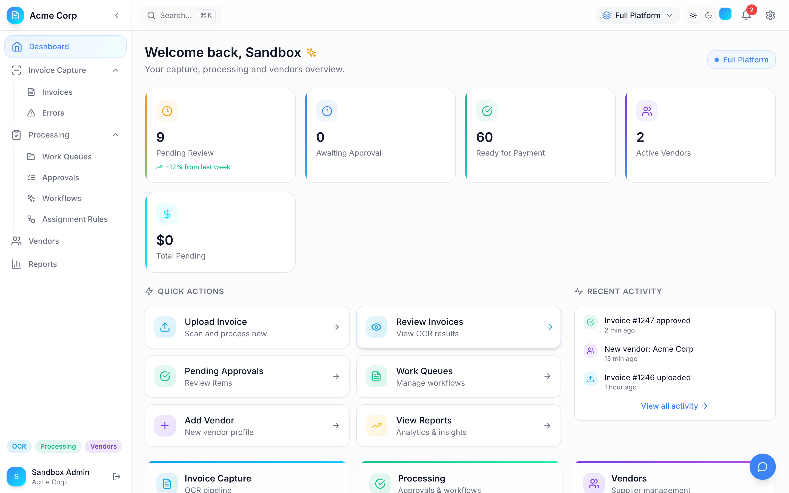
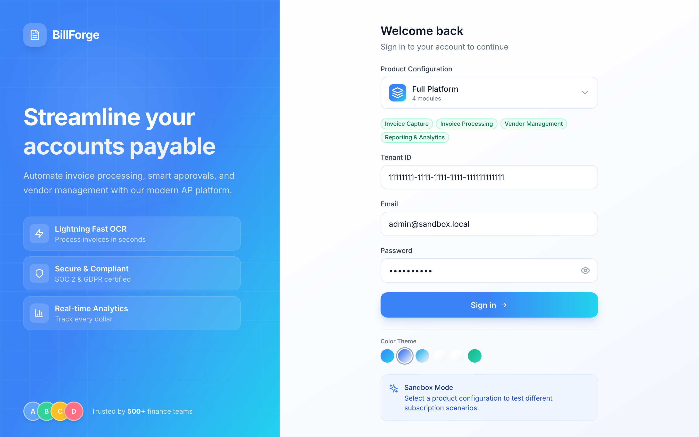
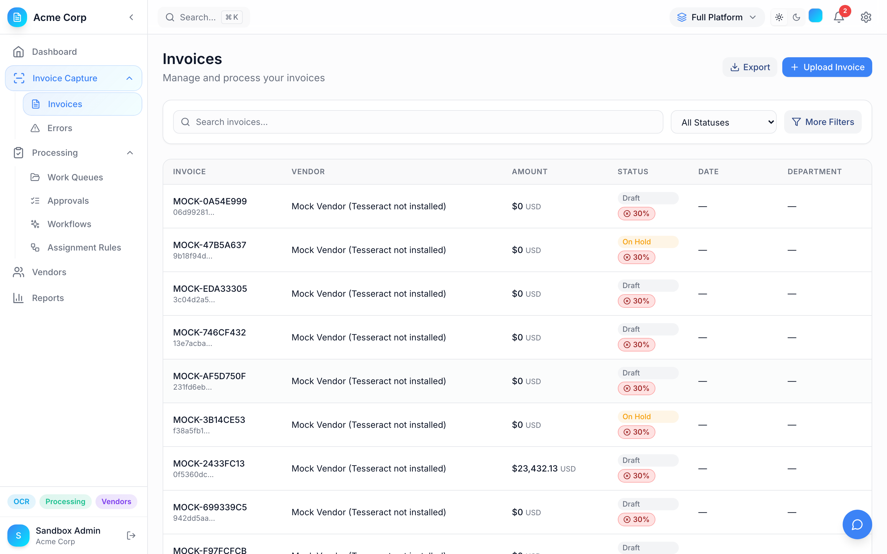
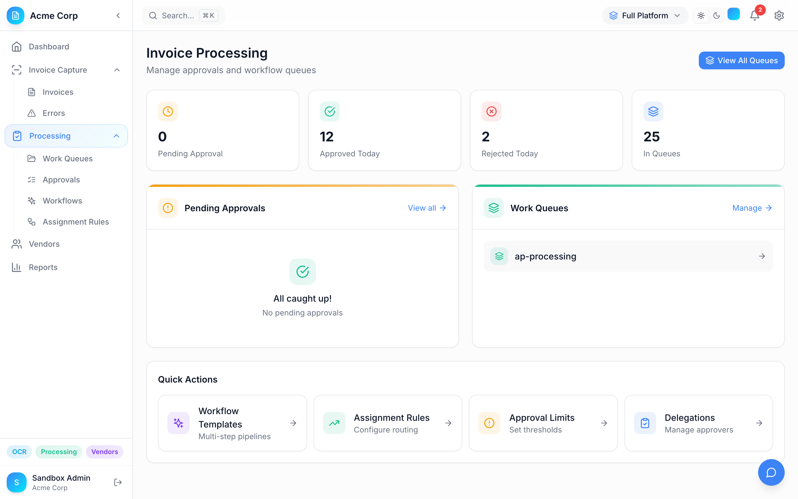
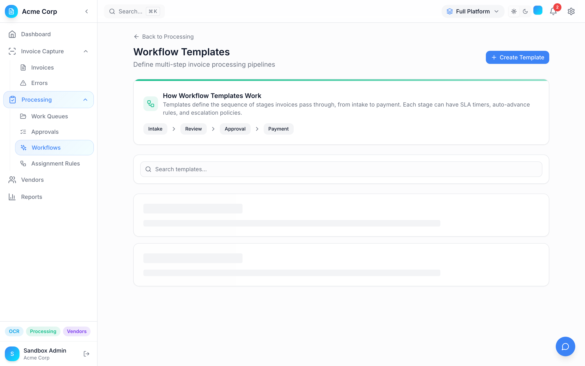
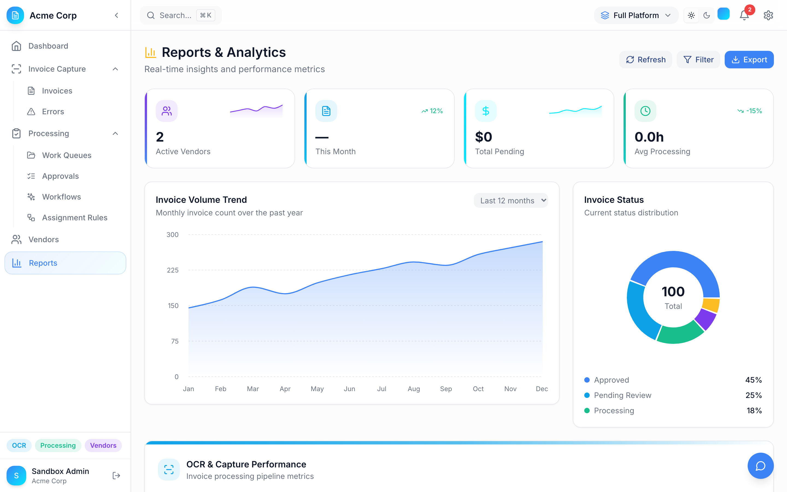
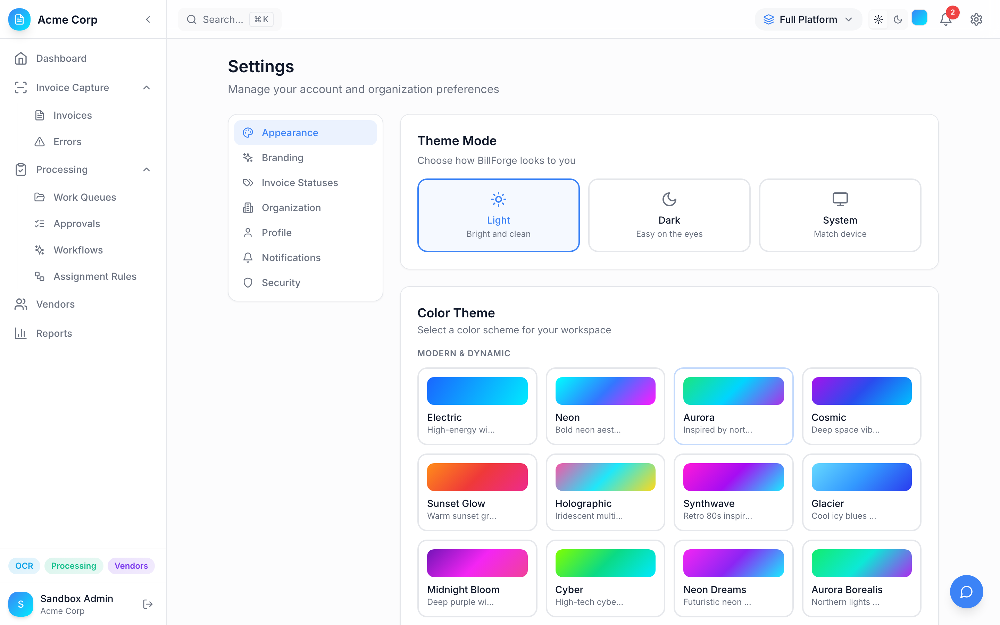
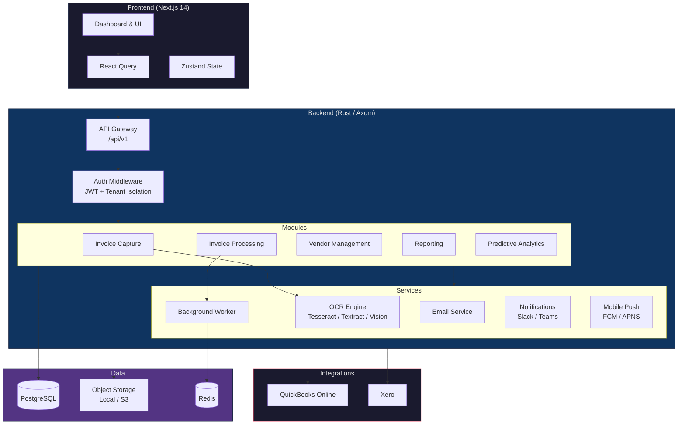
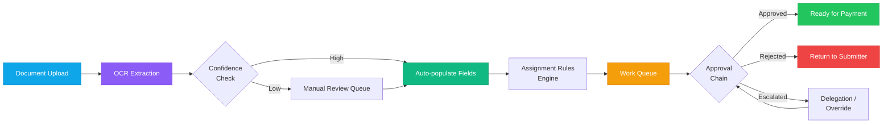
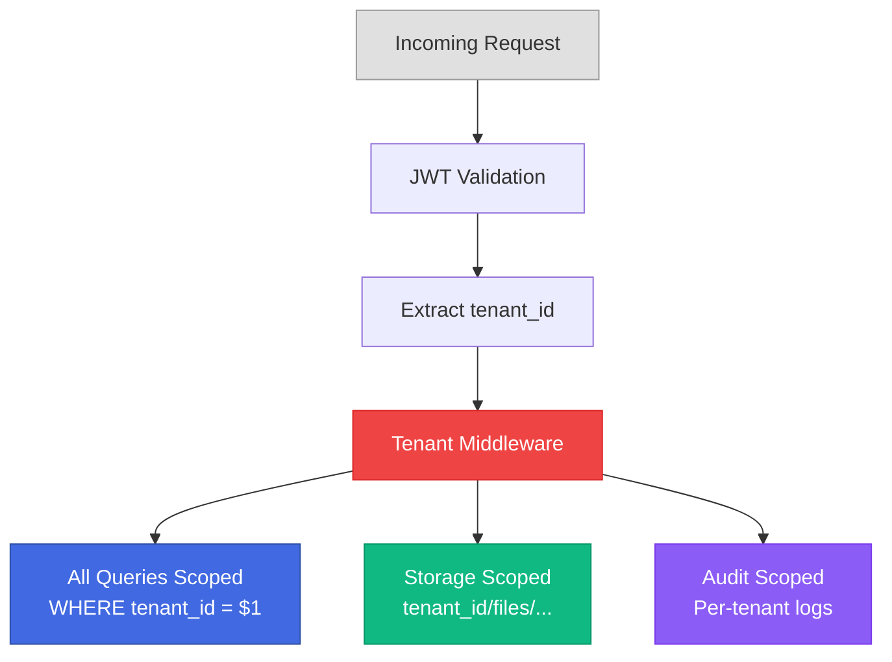

<p align="center">
  <h1 align="center">BillForge</h1>
  <p align="center">
    A modular, multi-tenant SaaS platform for Accounts Payable teams
    <br />
    <strong>Invoice Capture - Processing - Vendor Management - Reporting</strong>
  </p>
</p>

<p align="center">
  
  
  
  
  
  
</p>

---

## Overview

BillForge automates the full accounts payable lifecycle, from document capture through payment approval. Built as a modular monorepo with strict multi-tenant isolation, each module can be independently enabled per organization.

## Screenshots

<details open>
<summary><strong>Dashboard</strong> - Real-time KPIs, quick actions, and activity feed</summary>
<br />
<p align="center">
  
</p>
</details>

<details>
<summary><strong>Login</strong> - Multi-tenant login with product configuration</summary>
<br />
<p align="center">
  
</p>
</details>

<details>
<summary><strong>Invoices</strong> - Invoice management with search, filters, and status tracking</summary>
<br />
<p align="center">
  
</p>
</details>

<details>
<summary><strong>Invoice Processing</strong> - Approvals, work queues, and workflow management</summary>
<br />
<p align="center">
  
</p>
</details>

<details>
<summary><strong>Workflow Templates</strong> - Multi-step invoice processing pipelines</summary>
<br />
<p align="center">
  
</p>
</details>

<details>
<summary><strong>Reports</strong> - Analytics, charts, and performance metrics</summary>
<br />
<p align="center">
  
</p>
</details>

<details>
<summary><strong>Settings</strong> - Organization configuration and customization</summary>
<br />
<p align="center">
  
</p>
</details>

## Architecture

### System Architecture



### Invoice Processing Pipeline



## Modules

<table>
<tr>
<td width="50%">

### Invoice Capture
- Multi-provider OCR (Tesseract, AWS Textract, Google Vision)
- Confidence scoring with automatic field extraction
- Manual correction UI for low-confidence results
- Bulk upload and batch processing

</td>
<td width="50%">

### Invoice Processing
- Configurable work queues with priority ordering
- Assignment rules engine with multi-condition logic
- Multi-level approval chains
- Approval delegation and spending limits
- Workflow templates

</td>
</tr>
<tr>
<td width="50%">

### Vendor Management
- Full vendor lifecycle (onboarding to offboarding)
- Tax document collection and storage (W-9, 1099)
- Vendor contacts and communication log
- Vendor-specific approval routing

</td>
<td width="50%">

### Reporting & Analytics
- Real-time dashboard with KPIs
- Invoice aging analysis
- Vendor spend summaries
- Workflow performance metrics
- Predictive analytics and anomaly detection

</td>
</tr>
<tr>
<td width="50%">

### Integrations
- QuickBooks Online (OAuth 2.0)
- Xero (OAuth 2.0)
- Email-based approve/reject actions
- Slack and Teams notifications

</td>
<td width="50%">

### Mobile
- Delta sync protocol for offline-first mobile
- Push notifications (FCM + APNS)
- Mobile approval workflows
- Device management

</td>
</tr>
</table>

## Tech Stack

| Layer | Technology |
|-------|-----------|
| **Frontend** | Next.js 14 (App Router), TypeScript, Tailwind CSS, shadcn/ui |
| **State** | React Query (server), Zustand (client) |
| **Backend** | Rust, Axum 0.7, Tokio async runtime |
| **Database** | PostgreSQL 15+ via sqlx (59 migrations) |
| **Auth** | Custom JWT with per-request tenant validation |
| **OCR** | Tesseract (default), AWS Textract, Google Vision |
| **Storage** | Local filesystem or S3-compatible |
| **Cache** | Redis |
| **Testing** | Vitest, React Testing Library, MSW |
| **Infra** | Docker, Terraform |

## Project Structure

```
bill_forge/
├── apps/web/                       # Next.js 14 frontend
│   └── src/
│       ├── app/(dashboard)/        # App Router pages
│       │   ├── dashboard/          #   Dashboard & KPIs
│       │   ├── invoices/           #   Invoice CRUD, upload, detail
│       │   ├── vendors/            #   Vendor management
│       │   ├── processing/         #   Queues, rules, approvals
│       │   │   ├── queues/         #     Work queue management
│       │   │   ├── assignment-rules/ #   Routing rules
│       │   │   ├── workflows/      #     Workflow templates
│       │   │   ├── approvals/      #     Approval chains
│       │   │   ├── delegations/    #     Approval delegation
│       │   │   └── approval-limits/ #    Spending limits
│       │   ├── reports/            #   Analytics & export
│       │   └── settings/           #   Organization config
│       ├── components/ui/          # shadcn/ui components
│       └── lib/api.ts              # Typed API client
│
├── backend/
│   ├── crates/
│   │   ├── api/                    # Axum HTTP layer
│   │   ├── core/                   # Domain types & traits
│   │   ├── db/                     # PostgreSQL repositories
│   │   ├── auth/                   # JWT authentication
│   │   ├── invoice-capture/        # OCR pipeline
│   │   ├── invoice-processing/     # Workflow engine
│   │   ├── vendor-mgmt/           # Vendor lifecycle
│   │   ├── reporting/             # Analytics queries
│   │   ├── analytics/             # Predictive models
│   │   ├── quickbooks/            # QB Online OAuth
│   │   ├── xero/                  # Xero OAuth
│   │   ├── worker/                # Background jobs
│   │   ├── email/                 # SMTP service
│   │   ├── notifications/         # Slack / Teams
│   │   ├── mobile-push/           # FCM + APNS
│   │   └── feedback/              # User feedback
│   ├── migrations/                # 59 PostgreSQL migrations
│   └── Cargo.toml                 # Workspace manifest
│
├── sandbox/                       # Demo environment & seed data
├── terraform/                     # Infrastructure as code
└── docker/                        # Dockerfiles & compose configs
```

## Getting Started

### Prerequisites

- **Node.js** 20+ and **pnpm** 8+
- **Rust** 1.75+ (with `cargo-watch` for dev)
- **PostgreSQL** 15+
- **Docker** (optional, for managed infra)

### Quick Start

```bash
# 1. Clone and configure
git clone https://github.com/mark-styx/bill_forge.git
cd bill_forge
cp .env.example .env   # Edit with your settings

# 2. Start infrastructure (PostgreSQL, Redis, MinIO)
docker compose up -d postgres redis minio minio-init

# 3. Install frontend dependencies
pnpm install

# 4. Run database migrations
for f in backend/migrations/*.sql; do
  PGPASSWORD=postgres psql -h localhost -U postgres -d billforge -f "$f"
done

# 5. Seed demo data (optional)
cd backend && cargo run --bin seed && cd ..

# 6. Start backend (with hot reload)
pnpm backend:dev

# 7. Start frontend (separate terminal)
pnpm dev
```

Open [http://localhost:3000](http://localhost:3000) to access the application.

### Full-Stack Docker

Run everything in containers:

```bash
docker compose up --build
# API: http://localhost:8080
# Web: http://localhost:3000
# MinIO console: http://localhost:9001 (minioadmin/minioadmin)
```

### Sandbox Mode

Launch a pre-configured demo environment:

```bash
pnpm sandbox:start    # Start with seed data
pnpm sandbox:reset    # Reset to clean state
```

### Production Build

```bash
# Backend binary
cd backend && cargo build --release
# Output: backend/target/release/billforge-server

# Frontend
pnpm build
```

### Commands

| Command | Description |
|---------|-------------|
| `pnpm dev` | Frontend dev server |
| `pnpm backend:dev` | Backend with hot reload |
| `pnpm backend:build` | Production backend build |
| `pnpm db:migrate` | Run database migrations |
| `pnpm test` | Run all tests |
| `pnpm lint` | Lint all packages |
| `pnpm typecheck` | TypeScript type checking |

## Configuration

Configure via environment variables (see `.env.example`):

| Variable | Description | Default |
|----------|-------------|---------|
| `DATABASE_URL` | PostgreSQL connection string | Required |
| `JWT_SECRET` | JWT signing secret | Required in production |
| `BACKEND_HOST` | Bind address | `127.0.0.1` |
| `BACKEND_PORT` | Server port | `8080` |
| `STORAGE_PROVIDER` | `local` or `s3` | `local` |
| `OCR_PROVIDER` | `tesseract`, `aws_textract`, `google_vision` | `tesseract` |
| `REDIS_URL` | Redis connection | Optional |

## API Reference

All endpoints under `/api/v1`, authenticated via JWT Bearer token with tenant context.

```mermaid
graph LR
    subgraph Core
        A[/auth]
        B[/invoices]
        C[/vendors]
        D[/documents]
    end

    subgraph Processing
        E[/workflows]
        F[/dashboard]
        G[/reports]
        H[/audit]
    end

    subgraph Integrations
        I[/quickbooks]
        J[/xero]
        K[/mobile]
        L[/analytics/predictive]
    end

    subgraph Config
        M[/settings]
        N[/feedback]
        O[/actions]
    end

    style Core fill:#0ea5e9,stroke:#0284c7,color:#fff
    style Processing fill:#8b5cf6,stroke:#7c3aed,color:#fff
    style Integrations fill:#f59e0b,stroke:#d97706,color:#fff
    style Config fill:#6b7280,stroke:#4b5563,color:#fff
```

Health endpoints: `/health`, `/health/live`, `/health/ready`, `/health/detailed`

## Multi-Tenancy



Every database query, storage operation, and audit log is scoped to the authenticated tenant. Cross-tenant data access is architecturally impossible.

## License

Proprietary - All rights reserved
